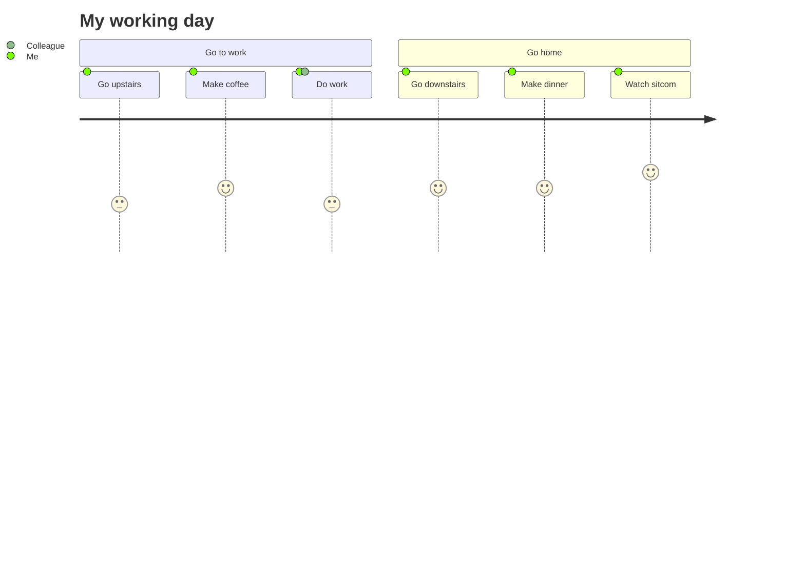

### Hi there 👋

<!-- ## Brief -->
<!-- - 🔭 I’m currently working on - My blog. -->
<!-- - 🌱 I’m currently learning - Typescript. -->

<!--  -->
<!--  -->

<!--  -->

<!-- ### Languages
<code></code>
<code></code>
<code></code>
<code></code>
<code></code>
<code></code>
<code></code>
<code></code> -->

<!--  -->

<!-- 

  
  

 -->
